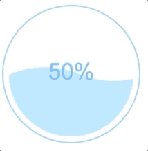

# react-wave-progress

水波进度球组件 react实现



## Install

```bash
npm install react-wave-progress --save-dev
```

## Use

1. import Component

```js
import WaveProgress from 'react-wave-progress'
```

2. Use in your react component

```jsx
<WaveProgress r={100} percentage={50}/>
```

## props

|prop|meaning|example|
|-|-|-|
|r|The radius of the circle.|100|
|percentage|The process in percentage.[0, 100]|50|
|theme|'light' \| 'dark'|'light'|